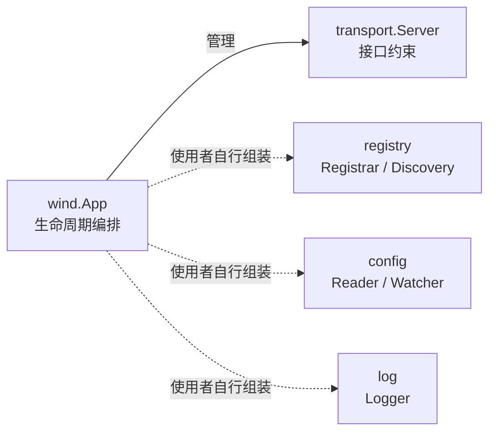
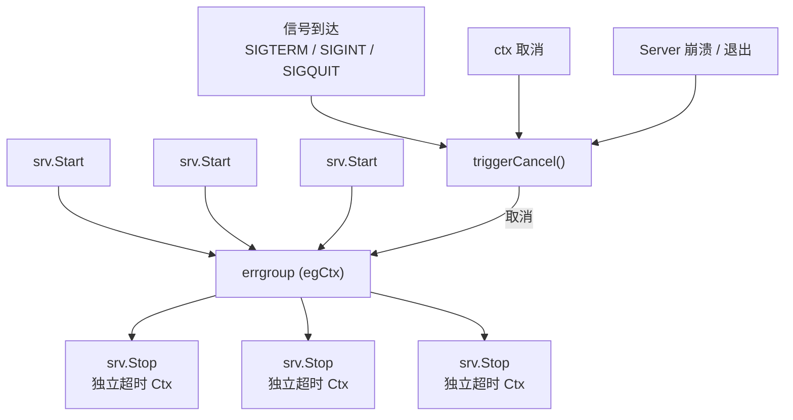

<div align="center">

# Go Wind

### 极简、可组合的 Go 微服务框架

积木式架构 · 接口驱动 · 零魔法 · 生产就绪

中文 · [English](./README_en.md) · [日本語](./README_ja.md)

</div>

---

## 设计哲学

> **不是全家桶，而是积木盒。**

go-wind 信奉 **组合优于继承、接口优于实现** 的 Go 原生哲学。框架只定义协议与生命周期骨架，不绑定任何具体基础设施。每一个模块——传输、注册中心、配置中心、日志——都只暴露最小接口，由使用者按需拼装，就像搭积木一样。

| 全家桶框架 | go-wind |
|:---:|:---:|
| 绑定 gRPC + etcd + zap | 你选 gRPC 还是 HTTP？你决定 |
| 框架接管一切 | 框架只管生命周期 |
| 升级框架 = 升级全家桶 | 升级框架 = 升级骨架 |
| 学习曲线陡峭 | 5 分钟读完源码 |

---

## 核心特性

- **积木式组装** — 四大模块（传输 / 注册中心 / 配置 / 日志）全部接口化，零硬编码依赖，自由组合
- **优雅生命周期** — 信号感知、超时可控的 Server 启停；单服务崩溃自动级联全量优雅退出
- **无侵入 Context** — TraceID / UserID / ColorTag 通过 context 传播，深拷贝防 data race
- **极简日志门面** — 4 方法接口 + `With`，三行胶水代码即可适配 slog / zap / zerolog / kratos log
- **功能选项模式** — `WithServer`、`WithName`… 链式配置，类型安全，可读性强
- **零外部依赖** — 仅依赖 `golang.org/x/sync`，框架本身不到 500 行代码

---

## 快速开始

### 安装

```bash
go get github.com/tx7do/go-wind
```

### 最小示例

```go
package main

import (
    "context"
    "log"

    wind "github.com/tx7do/go-wind"
    "github.com/tx7do/go-wind/transport"
)

// MyServer 实现 transport.Server 接口
type MyServer struct{}

func (s *MyServer) Start(ctx context.Context) error {
    <-ctx.Done()
    return ctx.Err()
}

func (s *MyServer) Stop(ctx context.Context) error {
    // 执行清理逻辑（ctx 携带超时）
    return nil
}

func main() {
    app := wind.New(
        wind.WithID("order-service-01"),
        wind.WithName("order-service"),
        wind.WithVersion("v1.0.0"),
        wind.WithServer(&MyServer{}),
    )

    if err := app.Run(context.Background()); err != nil {
        log.Fatal(err)
    }
}
```

### 多 Server 组合

```go
app := wind.New(
    wind.WithName("gateway"),
    wind.WithServer(grpcServer, httpServer, wsServer),
)

// 三个 Server 并发启动，收到信号后并发优雅停止
app.Run(ctx)
```

### 积木式组装注册中心

```go
app := wind.New(
    wind.WithName("user-service"),
    wind.WithServer(grpcServer),
)

// 注册中心、日志、配置——全部由你组装，框架不做任何假设
inst := &wind.Instance{
    ID:        app.ID(),
    Name:      app.Name(),
    Version:   app.Version(),
    Endpoints: []string{"grpc://0.0.0.0:9000"},
}

// 使用你选的注册中心实现
registrar.Register(ctx, inst)
defer registrar.Deregister(ctx, inst)

app.Run(ctx)
```

### 日志接入

```go
import windlog "github.com/tx7do/go-wind/log"

// 使用内置 slog 适配器
windlog.SetLogger(windlog.NewSlogLogger())

// 或者适配你自己的日志后端
windlog.SetLogger(myZapAdapter{})
```

---

## 模块架构



> 虚线表示框架不强制绑定，由使用者按需组装。

```text
go-wind/
├── app.go              核心引擎：App 生命周期管理
├── context.go          请求级元数据传播（TraceID / UserID / Metadata）
├── instance.go         服务实例模型 & Context 绑定
├── transport/          传输层抽象（Server / Transporter）
├── registry/           服务注册与发现抽象（Registrar / Discovery）
├── config/             配置源抽象（Reader / Watcher / ReadWatcher）
└── log/                日志门面（Logger 接口 + slog 适配 + nop 实现）
```

### 模块总览

| 模块 | 核心接口 | 职责 |
|:---|:---|:---|
| `wind` | `App`, `Option` | 应用生命周期编排、优雅停机 |
| `wind` | `Instance` | 服务实例建模、Context 传播 |
| `wind` | `Metadata` | 请求级元数据（TraceID 等）链路传播 |
| `transport` | `Server`, `Transporter` | 传输层抽象，支持任意协议接入 |
| `registry` | `Registrar`, `Discovery`, `Watcher` | 服务注册、发现与变更监听 |
| `config` | `Reader`, `Watcher`, `ReadWatcher` | 配置读取、热更新监听 |
| `log` | `Logger` | 日志门面，适配任意后端 |

---

## 生命周期与优雅停机

go-wind 的核心能力是 **可靠的应用生命周期管理**：



**设计要点：**

| 机制 | 说明 |
|:---|:---|
| 独立停机上下文 | Stop context 从 `context.Background()` 派生，**不**从运行 context 派生，确保超时窗口真实有效 |
| 崩溃级联 | 任一 Server 崩溃或自行退出，errgroup 自动触发其余 Server 优雅停止 |
| 无双重 Stop | `App.Stop()` 只触发取消信号，不直接调用 `Server.Stop()`，停机逻辑统一收口 |
| 信号感知 | 默认监听 `SIGTERM` / `SIGINT` / `SIGQUIT`，可自定义 |

---

## 设计原则

### 1. 接口最小化

每个接口只定义必要方法。例如 `Logger` 只有 4 个日志方法 + 1 个 `With`，适配任意后端只需几行胶水代码。

### 2. 零隐式依赖

框架不对你的注册中心、配置中心、日志库做任何假设。`go.mod` 中只有一个依赖：`golang.org/x/sync`。

### 3. Context 原生

所有接口的第一个参数都是 `context.Context`，与 Go 标准库哲学一致，支持链路追踪和超时传播。

### 4. 并发安全

全局状态（logger）、元数据传播均做了并发安全处理，`WithTraceID` 对共享 map 做深拷贝避免 data race。

---

## 环境要求

| 项 | 要求 |
|:---|:---|
| Go 版本 | 1.21+ |
| 外部依赖 | 仅 `golang.org/x/sync` |

---

## 开源许可

[MIT License](./LICENSE)
