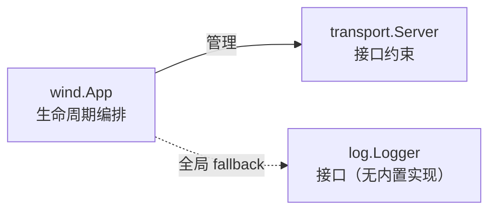
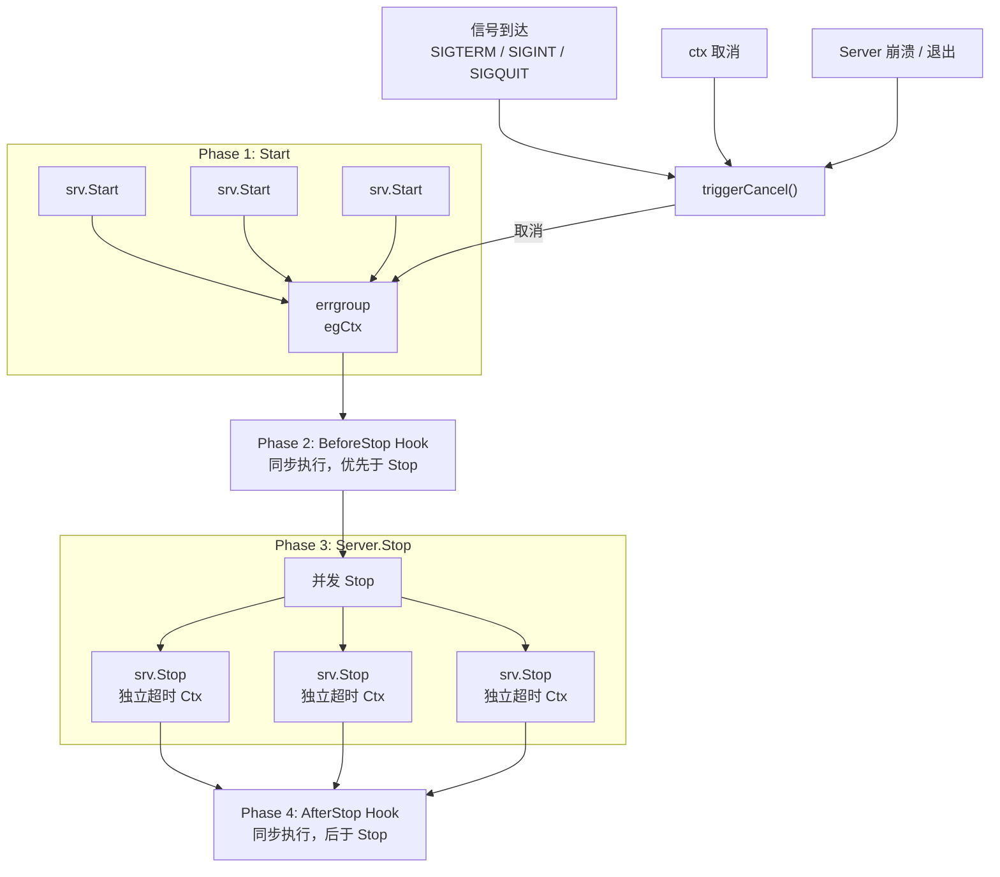

<div align="center">

# Go Wind

### 极简、可组合的 Go 微服务框架

积木式架构 · 接口驱动 · 零魔法 · 生产就绪

中文 · [English](./README_en.md) · [日本語](./README_ja.md)

</div>

---

## 设计哲学

> **不是全家桶，而是积木盒。**

go-wind 信奉 **组合优于继承、接口优于实现** 的 Go 原生哲学。框架只定义协议与生命周期骨架，不绑定任何具体基础设施。每一个模块——传输、注册中心、日志——都只暴露最小接口，由使用者按需拼装，就像搭积木一样。

| 全家桶框架 | go-wind |
|:---:|:---:|
| 绑定 gRPC + etcd + zap | 你选 gRPC 还是 HTTP？你决定 |
| 框架接管一切 | 框架只管生命周期 |
| 升级框架 = 升级全家桶 | 升级框架 = 升级骨架 |
| 学习曲线陡峭 | 5 分钟读完源码 |

---

## 核心特性

- **积木式组装** — 核心仅管生命周期，传输/日志只暴露最小接口。注册中心、配置中心等能力由 [go-wind-plugins](https://github.com/tx7do/go-wind-plugins) 提供具体实现
- **优雅生命周期** — 信号感知、超时可控的 Server 启停；单服务崩溃自动级联全量优雅退出
- **无侵入 Context** — TraceID / UserID / ColorTag 通过 context 传播，深拷贝防 data race
- **极简日志门面** — 4 方法接口 + `Enabled` + `With`，几行胶水代码即可适配 slog / zap / zerolog / kratos log；具体适配器（slog adapter、LevelFilter、MultiLogger）由 [go-wind-plugins](https://github.com/tx7do/go-wind-plugins) 提供
- **功能选项模式** — `WithServer`、`WithName`… 链式配置，类型安全，可读性强
- **零外部依赖** — 仅依赖 `golang.org/x/sync`，框架本身不到 500 行代码

---

## 快速开始

### 安装

```bash
go get github.com/tx7do/go-wind
```

### 最小示例

```go
package main

import (
    "context"
    "log"

    wind "github.com/tx7do/go-wind"
    "github.com/tx7do/go-wind/transport"
)

// MyServer 实现 transport.Server 接口
type MyServer struct{}

func (s *MyServer) Start(ctx context.Context) error {
    <-ctx.Done()
    return ctx.Err()
}

func (s *MyServer) Stop(ctx context.Context) error {
    // 执行清理逻辑（ctx 携带超时）
    return nil
}

func (s *MyServer) Endpoint() string {
    return "grpc://0.0.0.0:9000"
}

func main() {
    app := wind.New(
        wind.WithID("order-service-01"),
        wind.WithName("order-service"),
        wind.WithVersion("v1.0.0"),
        wind.WithServer(&MyServer{}),
    )

    if err := app.Run(context.Background()); err != nil {
        log.Fatal(err)
    }
}
```

### 多 Server 组合

```go
app := wind.New(
    wind.WithName("gateway"),
    wind.WithServer(grpcServer, httpServer, wsServer),
)

// 三个 Server 并发启动，收到信号后并发优雅停止
app.Run(ctx)
```

### 服务实例构建

```go
app := wind.New(
    wind.WithName("user-service"),
    wind.WithServer(grpcServer),
)

// 构建服务实例，用于注册到你选的注册中心实现（go-wind-plugins）
inst := app.Instance("grpc://0.0.0.0:9000")
// inst.ID / inst.Name / inst.Version / inst.Endpoints

app.Run(ctx)
```

### 日志接入

```go
import windlog "github.com/tx7do/go-wind/log"

// 方式一：实现 log.Logger 接口，适配你的日志后端（slog / zap / zerolog…）
// 具体适配器（slog adapter、LevelFilter、MultiLogger）由 go-wind-plugins 提供
windlog.SetLogger(myZapAdapter{})

// 方式二：使用 go-wind-plugins/log/slog 提供的适配器
//   import pluginslog "github.com/tx7do/go-wind-plugins/log/slog"
//   windlog.SetLogger(pluginslog.New(mySlogLogger))

// App 级别日志器，未设置时回退到全局 logger
app.Logger().Info(ctx, "starting")

// 昂贵参数构造可用 Enabled 守卫
logger := app.Logger()
if logger.Enabled(windlog.LevelDebug) {
    logger.Debug(ctx, "detail", computeExpensiveData())
}
```

### 高级配置

```go
app := wind.New(
    wind.WithServer(grpcServer),
    wind.WithStopTimeout(30*time.Second),  // 自定义优雅停机超时
    wind.WithSignal(syscall.SIGTERM),       // 自定义信号
    wind.WithLogger(myLogger),              // App 级别独立日志器
    wind.WithBeforeStop(func(ctx context.Context) error {
        // 停机前回调：注销服务、排空请求队列
        // 使用你选的注册中心实现（go-wind-plugins）
        return nil
    }),
    wind.WithAfterStop(func(ctx context.Context) error {
        // 停机后回调：关闭数据库连接、刷入缓冲
        return db.Close()
    }),
)

// App 级别日志器，未设置时回退到全局 logger
app.Logger().Info(ctx, "starting")

// Server.Endpoint() 返回实际监听地址（支持随机端口 :0）
endpoint := grpcServer.Endpoint()

// 等待 App 结束（可用于外部编排）
<-app.Done()
// 获取 Run 最终错误（需在 Done 关闭后调用）
if err := app.Err(); err != nil {
    log.Fatal(err)
}
```

---

## 模块架构



> 核心只管 Server 生命周期。日志仅提供接口 + 全局注册器；注册中心、配置中心等由 [go-wind-plugins](https://github.com/tx7do/go-wind-plugins) 提供。

```text
go-wind/
├── app.go              核心引擎：App 生命周期管理
├── errors.go           集中错误定义（包级哨兵错误）
├── context.go          请求级元数据传播（TraceID / UserID / Metadata）
├── instance.go         服务实例模型
├── errors/             结构化、传输感知的错误模型（WindError）
├── transport/          传输层抽象（Server）
└── log/                日志门面（Logger 接口 + Level + nop 实现 + 全局注册器）
```

### 模块总览

| 模块 | 核心接口 | 职责 |
|:---|:---|:---|
| `wind` | `App`, `Option` | 应用生命周期编排、优雅停机 |
| `wind` | `Instance` | 服务实例建模 |
| `wind` | `Metadata` | 请求级元数据（TraceID 等）链路传播 |
| `transport` | `Server` | 传输层抽象，支持任意协议接入 |
| `log` | `Logger`, `Level` | 日志接口契约 + 全局注册器；适配器由 plugins 提供 |

---

## 生命周期与优雅停机

go-wind 的核心能力是 **可靠的应用生命周期管理**：



**设计要点：**

| 机制 | 说明 |
|:---|:---|
| 独立停机上下文 | Stop context 从 `context.Background()` 派生，**不**从运行 context 派生，确保超时窗口真实有效 |
| 崩溃级联 | 任一 Server 崩溃或自行退出，errgroup 自动触发其余 Server 优雅停止 |
| 无双重 Stop | `App.Stop()` 只触发取消信号，不直接调用 `Server.Stop()`，停机逻辑统一收口 |
| 信号感知 | 默认监听 `SIGTERM` / `SIGINT` / `SIGQUIT`，可自定义 |
| 生命周期 Hook | `WithBeforeStop` / `WithAfterStop` 分阶段顺序执行：BeforeStop → Server.Stop → AfterStop，每阶段独立超时上下文 |
| Server.Endpoint | Server 实现暴露实际监听地址，支持 `:0` 随机端口绑定后获取真实地址用于注册 |
| App.Err | `App.Err()` 在 `Done()` 关闭后返回 Run 的最终错误，便于外部编排感知结果 |

---

## 设计原则

### 1. 接口最小化

每个接口只定义必要方法。例如 `Logger` 有 4 个日志方法 + `Enabled` + `With`，适配任意后端只需几行胶水代码。`Enabled` 方法让使用者在昂贵参数构造前检查级别。

### 2. 零隐式依赖

框架不对你的注册中心、配置中心、日志库做任何假设。`go.mod` 中只有一个依赖：`golang.org/x/sync`。

### 3. Context 原生

所有接口的第一个参数都是 `context.Context`，与 Go 标准库哲学一致，支持链路追踪和超时传播。

### 4. 并发安全

全局状态（logger）、元数据传播均做了并发安全处理，`WithTraceID` 对共享 map 做深拷贝避免 data race。

---

## 环境要求

| 项 | 要求 |
|:---|:---|
| Go 版本 | 1.23+ |
| 外部依赖 | 仅 `golang.org/x/sync` |

---

## 开源许可

[MIT License](./LICENSE)
