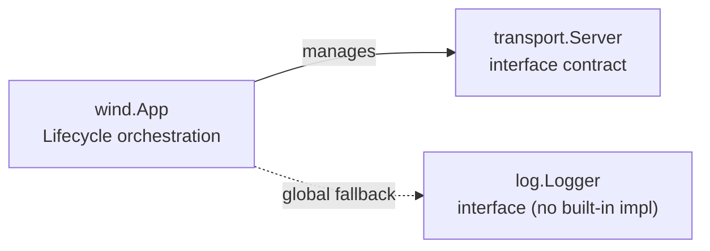
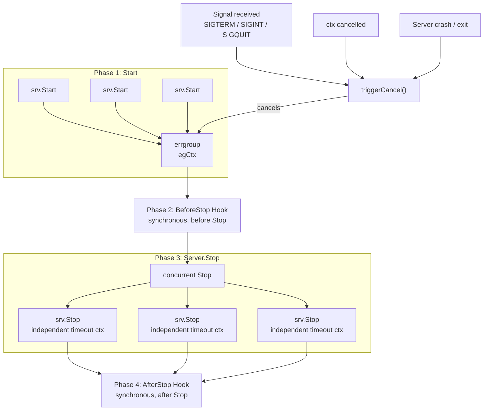

<div align="center">

# Go Wind

### A Minimalist, Composable Microservice Framework for Go

Lego-like Architecture · Interface-Driven · Zero Magic · Production-Ready

[中文](./README.md) · English · [日本語](./README_ja.md)

</div>

---

## Design Philosophy

> **Not a bundled framework — a box of building blocks.**

go-wind embraces the native Go philosophy: **composition over inheritance, interfaces over implementations.** The framework defines only protocols and lifecycle scaffolding — no infrastructure is hard-wired. Every module (transport, registry, logging) exposes a minimal interface; callers assemble them like Lego bricks.

| Bundled Frameworks | go-wind |
|:---:|:---:|
| Locks you into gRPC + etcd + zap | You pick gRPC or HTTP — you decide |
| Framework owns everything | Framework owns only lifecycle |
| Upgrading = upgrading the whole stack | Upgrading = upgrading the skeleton |
| Steep learning curve | Read the source in 5 minutes |

---

## Key Features

- **Composable Assembly** — Core manages lifecycle only; transport/log expose minimal interfaces. Config, registry, and other capabilities are provided by [go-wind-plugins](https://github.com/tx7do/go-wind-plugins)
- **Graceful Lifecycle** — Signal-aware, timeout-controlled server start/stop; a single server crash cascades a full graceful shutdown
- **Non-Intrusive Context** — TraceID / UserID / ColorTag propagated via context with deep-copy to prevent data races
- **Minimal Log Facade** — 4-method interface + `Enabled` + `With`; adapt slog / zap / zerolog / kratos log in a few lines. Concrete adapters (slog adapter, LevelFilter, MultiLogger) are provided by [go-wind-plugins](https://github.com/tx7do/go-wind-plugins)
- **Functional Options** — `WithServer`, `WithName`… chainable, type-safe, readable configuration
- **Zero External Dependencies** — Only `golang.org/x/sync`; the framework itself is under 500 lines

---

## Quick Start

### Installation

```bash
go get github.com/tx7do/go-wind
```

### Minimal Example

```go
package main

import (
    "context"
    "log"

    wind "github.com/tx7do/go-wind"
    "github.com/tx7do/go-wind/transport"
)

// MyServer implements transport.Server
type MyServer struct{}

func (s *MyServer) Start(ctx context.Context) error {
    <-ctx.Done()
    return ctx.Err()
}

func (s *MyServer) Stop(ctx context.Context) error {
    // Perform cleanup (ctx carries a timeout)
    return nil
}

func (s *MyServer) Endpoint() string {
    return "grpc://0.0.0.0:9000"
}

func main() {
    app := wind.New(
        wind.WithID("order-service-01"),
        wind.WithName("order-service"),
        wind.WithVersion("v1.0.0"),
        wind.WithServer(&MyServer{}),
    )

    if err := app.Run(context.Background()); err != nil {
        log.Fatal(err)
    }
}
```

### Multiple Servers

```go
app := wind.New(
    wind.WithName("gateway"),
    wind.WithServer(grpcServer, httpServer, wsServer),
)

// All three servers start concurrently and stop gracefully on signal
app.Run(ctx)
```

### Service Instance

```go
app := wind.New(
    wind.WithName("user-service"),
    wind.WithServer(grpcServer),
)

// Build a service instance for your chosen registry implementation (go-wind-plugins)
inst := app.Instance("grpc://0.0.0.0:9000")
// inst.ID / inst.Name / inst.Version / inst.Endpoints

app.Run(ctx)
```

### Logging Integration

```go
import windlog "github.com/tx7do/go-wind/log"

// Option 1: implement log.Logger to adapt your own backend (slog / zap / zerolog…)
// Concrete adapters (slog adapter, LevelFilter, MultiLogger) are in go-wind-plugins
windlog.SetLogger(myZapAdapter{})

// Option 2: use the adapter from go-wind-plugins/log/slog
//   import pluginslog "github.com/tx7do/go-wind-plugins/log/slog"
//   windlog.SetLogger(pluginslog.New(mySlogLogger))

// App-level logger; falls back to the global logger if not set
app.Logger().Info(ctx, "starting")

// Guard expensive argument construction with Enabled
logger := app.Logger()
if logger.Enabled(windlog.LevelDebug) {
    logger.Debug(ctx, "detail", computeExpensiveData())
}
```

### Advanced Configuration

```go
app := wind.New(
    wind.WithServer(grpcServer),
    wind.WithStopTimeout(30*time.Second),  // custom graceful shutdown timeout
    wind.WithSignal(syscall.SIGTERM),       // custom signal set
    wind.WithLogger(myLogger),              // app-level logger
    wind.WithBeforeStop(func(ctx context.Context) error {
        // Pre-shutdown hook: deregister service, drain request queue
        // Use your chosen registry implementation (go-wind-plugins)
        return nil
    }),
    wind.WithAfterStop(func(ctx context.Context) error {
        // Post-shutdown hook: close DB connections, flush buffers
        return db.Close()
    }),
)

// App-level logger; falls back to the global logger if not set
app.Logger().Info(ctx, "starting")

// Server.Endpoint() returns the actual listening address (supports :0 random port)
endpoint := grpcServer.Endpoint()

// Wait for the app to finish (useful for external supervision)
<-app.Done()
// Retrieve Run's final error (must be called after Done is closed)
if err := app.Err(); err != nil {
    log.Fatal(err)
}
```

---

## Module Architecture



> Core manages Server lifecycle only. Logging provides just the interface + global registry; config, registry, etc. are provided by [go-wind-plugins](https://github.com/tx7do/go-wind-plugins).

```text
go-wind/
├── app.go              Core engine: App lifecycle management
├── errors.go           Centralized error definitions
├── context.go          Request-scoped metadata propagation (TraceID / UserID / Metadata)
├── instance.go         Service instance model
├── transport/          Transport abstraction (Server)
└── log/                Log facade (Logger interface + Level + nop impl + global registry)
```

### Module Overview

| Module | Core Interfaces | Responsibility |
|:---|:---|:---|
| `wind` | `App`, `Option` | Application lifecycle orchestration, graceful shutdown |
| `wind` | `Instance` | Service instance modeling |
| `wind` | `Metadata` | Request-scoped metadata (TraceID etc.) propagation |
| `transport` | `Server` | Transport-layer abstraction for any protocol |
| `log` | `Logger`, `Level` | Log interface contract + global registry; adapters in plugins |

---

## Lifecycle & Graceful Shutdown

The core capability of go-wind is **reliable application lifecycle management**:



**Design Highlights:**

| Mechanism | Description |
|:---|:---|
| Independent stop context | The Stop context is derived from `context.Background()` — **not** from the run context — ensuring the timeout window is real |
| Crash cascade | Any server crash or self-exit automatically triggers graceful shutdown of all other servers via errgroup |
| No double-Stop | `App.Stop()` only triggers cancellation; it never calls `Server.Stop()` directly — shutdown logic is centralized |
| Signal awareness | Listens for `SIGTERM` / `SIGINT` / `SIGQUIT` by default; fully customizable |
| Lifecycle hooks | `WithBeforeStop` / `WithAfterStop` execute in phased order: BeforeStop → Server.Stop → AfterStop, each phase with its own timeout context |
| Server.Endpoint | Server implementations expose their actual listening address, supporting `:0` random port binding for registry registration |
| App.Err | `App.Err()` returns Run's final error after `Done()` is closed, allowing external supervisors to observe the outcome |

---

## Design Principles

### 1. Minimal Interfaces

Each interface defines only the essential methods. For example, `Logger` has 4 log methods + `Enabled` + `With`; adapting any backend requires only a few lines of glue code. The `Enabled` method lets callers check the level before constructing expensive arguments.

### 2. Zero Implicit Dependencies

The framework makes no assumptions about your registry, config center, or logging library. `go.mod` has a single dependency: `golang.org/x/sync`.

### 3. Context-Native

Every interface takes `context.Context` as its first parameter, consistent with the Go standard library philosophy — supporting tracing and timeout propagation.

### 4. Concurrency-Safe

Global state (logger) and metadata propagation are concurrency-safe. `WithTraceID` deep-copies shared maps to prevent data races.

---

## Requirements

| Item | Requirement |
|:---|:---|
| Go version | 1.23+ |
| Dependencies | Only `golang.org/x/sync` |

---

## License

[MIT License](./LICENSE)
