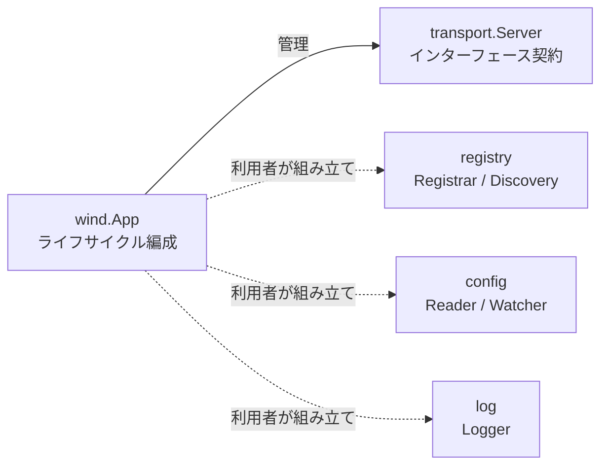
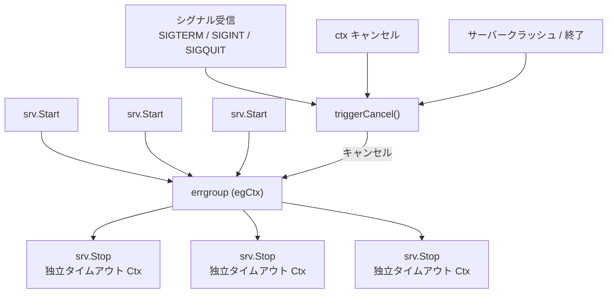

<div align="center">

# Go Wind

### ミニマルでコンポーザブルな Go マイクロサービスフレームワーク

レゴ型アーキテクチャ · インターフェース駆動 · ゼロマジック · 本番環境対応

[中文](./README.md) · [English](./README_en.md) · 日本語

</div>

---

## 設計哲学

> **オールインワンではなく、ブロックの箱。**

go-wind は Go のネイティブな哲学を掲げています：**継承より合成、実装よりインターフェース。** フレームワークはプロトコルとライフサイクルの骨組みのみを定義し、インフラストラクチャへの依存は一切ありません。各モジュール（トランスポート、レジストリ、設定、ログ）は最小限のインターフェースを公開し、利用者がレゴブロックのように組み立てます。

| オールインワンフレームワーク | go-wind |
|:---:|:---:|
| gRPC + etcd + zap にロックイン | gRPC か HTTP かはあなたが決める |
| フレームワークがすべてを管理 | フレームワークはライフサイクルのみ管理 |
| アップグレード = 全スタックの更新 | アップグレード = 骨組みのみの更新 |
| 学習コストが高い | ソースコードを5分で読了 |

---

## 主要機能

- **コンポーザブルな組み立て** — 4つのモジュール（トランスポート / レジストリ / 設定 / ログ）は完全にインターフェースベースで、ハードコードされた依存関係はゼロ
- **グレースフルなライフサイクル** — シグナル検知、タイムアウト制御付きサーバー起動/停止；単一サーバーのクラッシュが全サーバーのグレースフルシャットダウンをカスケード
- **非侵入型 Context** — TraceID / UserID / ColorTag は context 経由で伝播、data race を防ぐためディープコピーを実施
- **ミニマルログファサード** — 4メソッドインターフェース + `With`、slog / zap / zerolog / kratos log を数行で適応可能
- **関数型オプション** — `WithServer`、`WithName`… チェーン可能、型安全、可読性が高い
- **外部依存ゼロ** — `golang.org/x/sync` のみ、フレームワーク本体は500行未満

---

## クイックスタート

### インストール

```bash
go get github.com/tx7do/go-wind
```

### 最小サンプル

```go
package main

import (
    "context"
    "log"

    wind "github.com/tx7do/go-wind"
    "github.com/tx7do/go-wind/transport"
)

// MyServer は transport.Server インターフェースを実装
type MyServer struct{}

func (s *MyServer) Start(ctx context.Context) error {
    <-ctx.Done()
    return ctx.Err()
}

func (s *MyServer) Stop(ctx context.Context) error {
    // クリーンアップ処理（ctx はタイムアウトを保持）
    return nil
}

func main() {
    app := wind.New(
        wind.WithID("order-service-01"),
        wind.WithName("order-service"),
        wind.WithVersion("v1.0.0"),
        wind.WithServer(&MyServer{}),
    )

    if err := app.Run(context.Background()); err != nil {
        log.Fatal(err)
    }
}
```

### 複数サーバーの組み合わせ

```go
app := wind.New(
    wind.WithName("gateway"),
    wind.WithServer(grpcServer, httpServer, wsServer),
)

// 3つのサーバーが並行起動し、シグナル受信後に並行グレースフル停止
app.Run(ctx)
```

### レジストリのコンポーザブルな組み立て

```go
app := wind.New(
    wind.WithName("user-service"),
    wind.WithServer(grpcServer),
)

// レジストリ、ログ、設定 — すべてあなたが組み立てる
inst := &wind.Instance{
    ID:        app.ID(),
    Name:      app.Name(),
    Version:   app.Version(),
    Endpoints: []string{"grpc://0.0.0.0:9000"},
}

// 選択したレジストリ実装を使用
registrar.Register(ctx, inst)
defer registrar.Deregister(ctx, inst)

app.Run(ctx)
```

### ログ統合

```go
import windlog "github.com/tx7do/go-wind/log"

// 組み込みの slog アダプターを使用
windlog.SetLogger(windlog.NewSlogLogger())

// または独自のログバックエンドを適応
windlog.SetLogger(myZapAdapter{})
```

---

## モジュールアーキテクチャ



> 破線はフレームワークが強制バインドしないことを示します。利用者が自由に組み立てます。

```text
go-wind/
├── app.go              コアエンジン：App ライフサイクル管理
├── context.go          リクエストスコープメタデータ伝播（TraceID / UserID / Metadata）
├── instance.go         サービスインスタンスモデル & context バインディング
├── transport/          トランスポート抽象化（Server / Transporter）
├── registry/           サービス登録・発見の抽象化（Registrar / Discovery）
├── config/             設定ソース抽象化（Reader / Watcher / ReadWatcher）
└── log/                ログファサード（Logger インターフェース + slog アダプター + nop 実装）
```

### モジュール概要

| モジュール | コアインターフェース | 責務 |
|:---|:---|:---|
| `wind` | `App`, `Option` | アプリケーションライフサイクル編成、グレースフルシャットダウン |
| `wind` | `Instance` | サービスインスタンスモデリング、context 伝播 |
| `wind` | `Metadata` | リクエストスコープメタデータ（TraceID 等）の伝播 |
| `transport` | `Server`, `Transporter` | トランスポート層の抽象化、任意プロトコル対応 |
| `registry` | `Registrar`, `Discovery`, `Watcher` | サービス登録、発見、変更監視 |
| `config` | `Reader`, `Watcher`, `ReadWatcher` | 設定読み込み & ホットリロード監視 |
| `log` | `Logger` | ログファサード、任意バックエンドに適応可能 |

---

## ライフサイクル & グレースフルシャットダウン

go-wind のコア機能は **信頼性の高いアプリケーションライフサイクル管理** です：



**設計のポイント：**

| メカニズム | 説明 |
|:---|:---|
| 独立停止コンテキスト | Stop context は `context.Background()` から派生 — 実行 context から**ではなく** — タイムアウトウィンドウが実効性を持ちます |
| クラッシュカスケード | サーバーのクラッシュまたは自己終了が errgroup 経由で他の全サーバーのグレースフルシャットダウンを自動トリガー |
| ダブルストップ防止 | `App.Stop()` はキャンセルのみをトリガーし、`Server.Stop()` を直接呼び出しません — シャットダウンロジックは一元化 |
| シグナル検知 | デフォルトで `SIGTERM` / `SIGINT` / `SIGQUIT` を監視、完全にカスタマイズ可能 |

---

## 設計原則

### 1. ミニマルインターフェース

各インターフェースは必要最小限のメソッドのみを定義します。例えば `Logger` は4つのログメソッド + `With` のみで、任意のバックエンドへの適応は数行のグルーコードで済みます。

### 2. 暗黙的依存ゼロ

フレームワークはレジストリ、設定センター、ログライブラリについて一切の仮定をしません。`go.mod` の依存は `golang.org/x/sync` のみです。

### 3. Context ネイティブ

すべてのインターフェースの第一引数は `context.Context` で、Go 標準ライブラリの哲学と一致し、トレーシングとタイムアウト伝播をサポートします。

### 4. 並行安全性

グローバル状態（ロガー）とメタデータ伝播は並行安全です。`WithTraceID` は共有マップをディープコピーし、data race を防止します。

---

## 動作環境

| 項目 | 要件 |
|:---|:---|
| Go バージョン | 1.21+ |
| 依存関係 | `golang.org/x/sync` のみ |

---

## ライセンス

[MIT License](./LICENSE)
